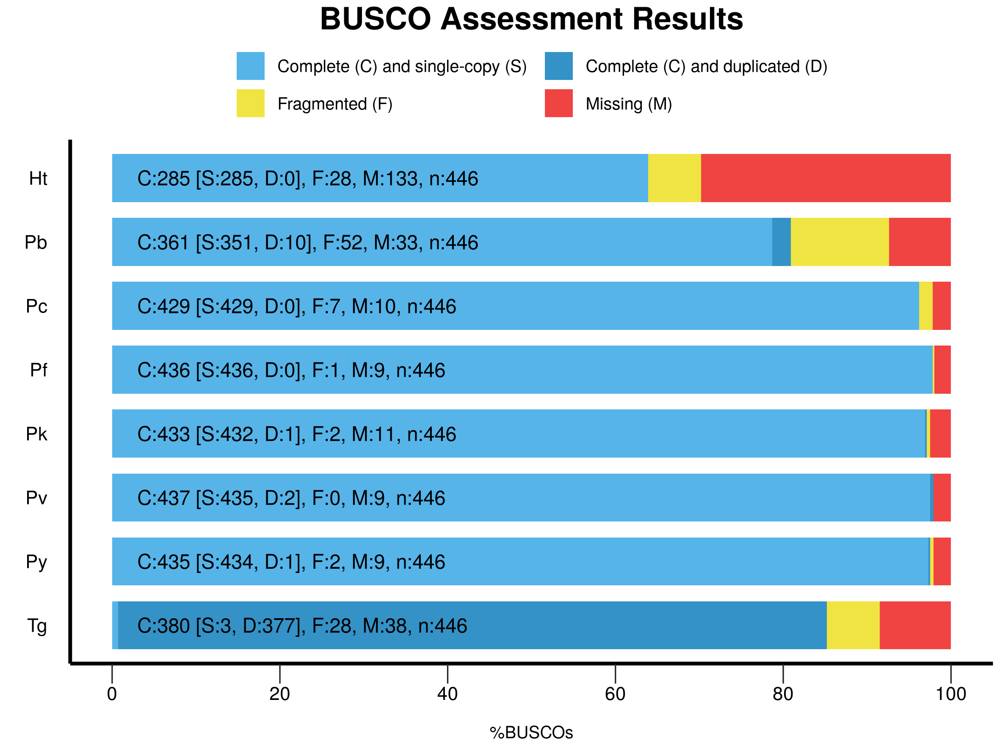
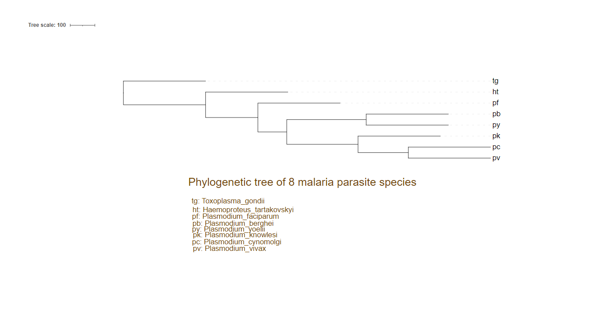

# Malaria parasite case study analysis

## Run GeneMark
 "First a gene prediction on all the plasmodium genome files using GeneMark is carried out using the gmes_petap.pl program."
GeneMark (http://exon.gatech.edu/GeneMark/)

```bash
# this command runs the GeneMark Gene prediction program on each genenome file. 
# The output is a gff file saved in the same directory
#1. Plasmodium_cynomolgi.genome
nohup gmes_petap.pl --ES --sequence Plasmodium_cynomolgi.genome &

#2. 10000 is used for the Plasmodium_berghei.genome as it has fewer contigs (and the default with GeneMark is 50000)
nohup gmes_petap.pl --ES --sequence Plasmodium_berghei.genome --min_contig 10000 &

#3. Plasmodium_yoelii.genome
nohup gmes_petap.pl --ES --sequence Plasmodium_yoelii.genome & 

#4. Plasmodium_faciparum.genome
nohup gmes_petap.pl --ES --sequence Plasmodium_faciparum.genome & 

#5. Plasmodium_knowlesi.genome
# Before running this for Pk, remove the repeated "chromosome" characters from the headers in the genome file:
grep -v '^chromosome' ../1_genome_files/Plasmodium_knowlesi.genome > ../1_genome_files/new.pk.genome

#Now, run gene prediction for Plasmodium_knowlesi.genome
nohup gmes_petap.pl --ES --sequence Plasmodium_knowlesi.genome & 

#6. Plasmodium_vivax.genome
nohup gmes_petap.pl --ES --sequence Plasmodium_vivax.genome & 

#7. Toxoplasma_gondii.genome
nohup gmes_petap.pl --ES --sequence Plasmodium_gondii.genome & 
```
### for ease amd file organization, all genome files should be ssaved to 1_genome_files directory and all gtf output file from GeneMark should be saved to 2_gtf_files directoy

## Processing of Haemoproteus tartakovskyi data
### Clean genome sequence
 The avian malaria paraiste genome to be used for this analysis is H. tartakovskyi genome, and was sequenced by the 454 technology. Since the input reads derive both from the bird and the plasmodium parasite, bird scaffolds will be removed.

```bash
# Use the python script provided in this repository and run it as follows:
python3 removeScaffold.py Haemoproteus_tartakovskyi.raw.genome 35 Ht.genome 3000

# Because the bird genome typically has GC content above 35 and scaffold length of less than 3000, these values are used to filter out the plasmodium parasite sequences 
```
### Run gene prediction on the filtered plasmodium genome.
```bash
# The following command should be run from the 3_Ht_data directory (containg the filtered genome fasta file)
gmes_petap.pl --ES --sequence Ht.genome --min_contig 10000
```
 "The gffParse.pl perl script is then used to create fasta sequences from the gff file and the genome files provided. The -c option is used."

### Do additional filtering on the gtf output file after gene prediction
```bash
# When run like this, the parser flags the gtf file:
gffParse.pl -i Ht.genome -g Ht2.gff -c -p -F

# This next command removes the first column in the gtf file to allow the gffParse.pl parser to run the filtering of genes from the genome file using information from the gene prediction file
cat genemark.gtf | sed "s/ GC=.*\tGeneMark.hmm/\tGeneMark.hmm/" > Ht2.gff

# Now, run the filtering
gffParse.pl -i Ht.genome -g Ht2.gff -c -p -F

# -F flag forces overwrite of any existing output in the directory
# The output includes a gffParse.fna and gffParse.faa file
```
### Remove scaffolds that have genes that are from avian origin. 

 For this purpose blastx or blastp is used. 
 ```bash
# Use echo $BLASTDB  to get the path of the BLAST databases on the cpourse server
 mkdir 4_blast # move up one folder and make a blast directory
 ```
### Run balst p using the gffParse.faa output (protein) from the 4_blast directory
```bash
nohup blastp -query ../3_Ht_data/gffParse.faa -db SwissProt -out Ht.blastp -num_descriptions 10 -num_alignments 5 -num_threads 25 &
 ```

 Next, we use the taxonomy for the top hit in the BLAST output to decide if the query sequence orginates from the host. 
 
 Once downladed, the datParser.py script is used to retrieve the host scaffolds. This way, we can tell if the if the query sequence orginates from the bird host or not. 

 ```bash
wget ftp://ftp.ebi.ac.uk/pub/databases/taxonomy/taxonomy.dat

# Also, download the SwissProt dat file:
wget ftp://ftp.uniprot.org/pub/databases/uniprot/current_release/knowledgebase/complete/uniprot_sprot.dat.gz
```

 Next, Remove the contigs deriving from the bird genome and save to a file
```bash
python datParser.py Ht.blastp ../3_Ht_data/gffParse.faa taxonomy.dat uniprot_sprot.dat > ../5_contigs_wo_birds/scaffolds.txt

# check the number of contigs belonging to bird
wc -l ../5_contigs_wo_birds/scaffolds.txt
# 23 contigs
```
### Now, the 23 contigs from the bird host genome needs to be removed from the original, filtered genome file (Ht.genome) obtained above

 A python script, exclude_bird_contigs.py, is written for this purpose, and then run as follows: 
```bash
# The cleaned fasta file is saved to a new file, since the script prints to standard output
python exclude_bird_contigs.py scaffolds.txt ../3_Ht_data/Ht.genome > cleaned.genome

# Check the number of sequences remaining and compare with the other file (containing the bird contigs)
grep -c "^>" ../3_Ht_data/Ht.genome
# 2343
grep -c "^>" cleaned.genome
# 2320
# 23 sequences were removed
```

## Run the genprediction again using the cleaned genome file
```bash
# The following command should be run from the 6_final_gene_pred directory (containg the cleaned genome fasta file)
gmes_petap.pl --ES --sequence ../5_contigs_wo_birds/cleaned.genome --min_contig 5000

# 5000 is used to allow the parser to include very short contigs in the prediction
```
### Again, create fasta sequences from the gtf file and the genome file using gffParse.pl
 The process is same as before. Run these while still in the 6_final_gene_pred directory

```bash
# Remember to modify the first column in the gtf file to allow the gffParse.pl parser to run the command
cat genemark.gtf | sed "s/ GC=.*\tGeneMark.hmm/\tGeneMark.hmm/" > Ht3.gff

# Now, run the command below to generate the fasta files
gffParse.pl -i ../5_contigs_wo_birds/cleaned.genome -g Ht3.gff -c -p -F

# -F overwrites existing outputs while -c option allows the adjustment of the Reading frames flagged in any warning. 
# The output includes a gffParse.fna and gffParse.faa file
```

## Identify orthologs among all the species
```bash
# Install proteinortho and BUSCO
#  version 6.3.1 check the documentation for details https://gitlab.com/paulklemm_PHD/proteinortho#readme
conda create -n protortho proteinortho -y
conda create -n busco busco -y

# Now, run proteinortho
conda activate protortho
```

### Run proteinortho on all the protein fasta outputs
```bash 
# First, copy all the .faa files from each gene prediction to a new directory 
# Rename all of them as follows:
mv gffParse.faa ht.faa
ht.faa  pb.faa  pc.faa  pf.faa  pk.faa  pv.faa  py.faa  tg.faa

# Note that proteinortho's blast pipeline has issues identifying the multiple characters in the sequence headers, so to avoid getting insufficient resulst, the headers in all 8 fasta files will need to be adjusted (leaving out the gene ids only).
# This command can be run individually on each file to effect the change withon the files:
cat pb.faa | sed "s/ GC=.*\tGeneMark.hmm/\tGeneMark.hmm/" > Ht2.gff
sed -i 's/\(_g\).*/\1/' pb.faa # pb
sed -i 's/\(_g\).*/\1/' pc.faa # pc
sed -i 's/\(_g\).*/\1/' pf.faa # pf
sed -i 's/\(_g\).*/\1/' pk.faa # pk
sed -i 's/\(_g\).*/\1/' pv.faa # pv
sed -i 's/\(_g\).*/\1/' py.faa # py
sed -i 's/\(_g\).*/\1/' tg.faa # tg
sed -i 's/\(_g\).*/\1/' ht.faa # ht

# Next run proteinortho as follows:
nohup proteinortho6.pl {ht,pb,pc,pf,pk,pv,py,tg}.faa &
```
 Explore the output from the proteinortho analysis. Use the cvommand below to find look at the orthologous groups in all the species.

```bash
# View the table in the .tsv file kin better readable format
column --table -s $'\t' myproject.proteinortho.tsv | less -S

# This shows the othologs in all the species where there are only 9 genes in the ortholog groups. In this case, only Toxoplasma gondii has co-orthologs while all the other 7 species have single orthologs each. 

# Count them
grep -c -P "^8\t9" myproject.proteinortho.tsv
# There are 334 of such ortholog groups
```

### Run busco
```bash
# Pb
busco -i ../8_proteinortho/pb.faa -o Pb -m prot -l apicomplexa
# Pc
busco -i ../8_proteinortho/pc.faa -o Pc -m prot -l apicomplexa
# Pf
busco -i ../8_proteinortho/pf.faa -o Pf -m prot -l apicomplexa
# Pk
busco -i ../8_proteinortho/pk.faa -o Pk -m prot -l apicomplexa
# Pv
busco -i ../8_proteinortho/pv.faa -o Pv -m prot -l apicomplexa
# Py
busco -i ../8_proteinortho/py.faa -o Py -m prot -l apicomplexa
# Ht
busco -i ../8_proteinortho/ht.faa -o Ht -m prot -l apicomplexa
# Tg
busco -i ../8_proteinortho/tg.faa -o Tg -m prot -l apicomplexa
```
```bash
# To visualize the busco results, make a director and copy all the text files into it. 
mkdir BUSCO_summaries
cd BUSCO_summaries/
cp Ht/short_summary.specific.apicomplexa_odb10.Ht.txt BUSCO_summaries/.
cp Pb/short_summary.specific.apicomplexa_odb10.Pb.txt BUSCO_summaries/.
cp Pc/short_summary.specific.apicomplexa_odb10.Pc.txt BUSCO_summaries/.
cp Pf/short_summary.specific.apicomplexa_odb10.Pf.txt BUSCO_summaries/.
cp Pk/short_summary.specific.apicomplexa_odb10.Pk.txt BUSCO_summaries/.
cp Pv/short_summary.specific.apicomplexa_odb10.Pv.txt BUSCO_summaries/.
cp Py/short_summary.specific.apicomplexa_odb10.Py.txt BUSCO_summaries/.
cp Tg/short_summary.specific.apicomplexa_odb10.Tg.txt BUSCO_summaries/.

# Use the provided python script to generate the plot
python generate_plot.py -wd BUSCO_summaries
```



### Next, create one protein fasta file per BUSCO based on the myproject.proteinortho.tsv file from proteinortho
 This can be done with the results from either the proteinortho or bsuco analysis. Here, the proteinortho results are used. 

```bash
#cd into the 9_proteinortho directory and create a new fasta file per ortholog or BUSCO gene to hold the orthologs
# But, first, create a new table that contains all the BUSCOs to be tracked

grep -P "^8\t9" myproject.proteinortho.tsv | cut -f 1 -d "," > modified_table.tsv

# This table does not have the headers, so save the headers to a new file
cat myproject.proteinortho.tsv | grep "^#" > headers

# Concatenate the headers and table of genes into one file using the merge_files.sh script in the 8_proteinortho directory
# Run as:
bash merge_files.sh orthologs_table.tsv headers modified_table.tsv

# A new table of orthologs, orthologs_table.tsv, is produced.  
```
 A python script is written to separate all orthologs/busco genes into files. It produces as many fasta files (containing genes belonging to the same ortholog group) as there are unique ortholog groups.:
```bash
mkdir 10_orthologs # Make a new directory to save the output

# From the  8_proteinortho directory, copy the python script, merged table, and fasta files into the new 10_orthologs directory
cp save_orthologs.py orthologs_table.tsv pb.faa pc.faa pf.faa pk.faa pv.faa py.faa tg.faa ht.faa ../10_orthologs/

# cd into the 10_orthologs directory, and then run the script as:
python save_orthologs.py orthologs_table.tsv pb.faa pc.faa pf.faa pk.faa pv.faa py.faa tg.faa ht.faa

ls -lh | wc -l # confirm how many files were generated 
```

## Alignments and trees for all individual BUSCO fasta files using clustalo
 First, install clustalo:
```bash
conda create -n clustalo clustalo raxml -y

# Run clustalo on the BUSCO/ortholog protein fasta files created above
conda activate clustalo

# Use a while loop
# first, make a directory to save the outputs 
mkidir alignments
# Then, run the command
ls busco_*.faa | while read file; do
    base=$(basename "$file" .faa)
    clustalo -i "$file" -o "alignments/${base}_aligned.faa" -v
    echo "Processing $file"
done

 # Clustal Omega - 1.2.4 (AndreaGiacomo). See documentation at http://www.clustal.org
```

Next, run RAxML on all the alignment files. This is better done with a bash script:
```bash
#!/bin/bash

# Loop through all aligned fasta files
for aligned_file in *aligned.faa; do
    # Extract the base name of the file (without extension)
    base_name=$(basename "$aligned_file" _aligned.faa)
    
    # Run RAxML
    raxmlHPC -s "$aligned_file" -n "${base_name}.tre" -o tg -m PROTGAMMABLOSUM62 -p 12345
    
    # Print processing message
    echo "Processing $aligned_file"
done
```
 
 The script is saved as run_raxml.sh and then run as below in the same diretory where the alignment files are saved:

```bash
bash run_raxml

# RAxML version 8.2.12. See documentation at https://cme.h-its.org/exelixis/resource/download/NewManual.pdf
# Use the command below to monitor the progress of the outputs 
watch -d 'ls RAxML_bestTree.busco_*.tre | wc -l' 

# After RAxML completes, run the command below to concatenate the results into a single file, which is ready for Consense
ls RAxML_bestTree.busco_*.tre > intree
```

 Install phylip using conda
```bash
conda create -n phylip phylip -y
conda activate phylip
version 3.69 # Consense documentation at https://phylipweb.github.io/phylip/doc/consense.html

# Run Consense as:
consense intree 
# Enter "Y" when prompted to confirm
```
 The consensus tree looks like this:
 (((((py:333.0,pb:333.0):322.0,(pk:333.0,(pv:333.0,pc:333.0):204.0):289.0):117.0,
 pf:333.0):212.0,ht:333.0):333.0,tg:333.0);

 When visualized at: http://itol.embl.de/, the results looks like this:




## Answer to questions
1. Do you think that in a phylogenetic tree the parasites that use
similar hosts will group together?

2. Why are the remaining scaffolds that derive from the bird shorter? 

3. Insert the missing data in the above table. Use bash, not inter-
net!

| #    | Species | Host | Genome size | Genes | Genomic GC (%)|
| :-------- | :------- | :------- | :------- | :------- | :------- |
|1  | Plasmodium berghei | rodents | 17954629 bp| 7235 | 23.71|
| 2 | Plasmodium cynomolgi | macaques | 26181343 bp | 5787 | 39.07 |
| 3 | Plasmodium falciparum | humans | 23270305 bp | 5207 | 19.36 |
| 4 | Plasmodium knowlesi | lemures | 23462187 bp | 4952 | 37.54 |
| 5 | Plasmodium vivax  | humans | 27007701 bp| 5682 | 42.21 |
| 6 | Plasmodium yoelii  | rodents | 22222369 bp | 4889 | 20.77 |
| 7 | Haemoproteus tartakovskyi  | birds | 17326467 bp| 3763 | 25.91 |
| 8 | Toxoplasma gondii | humans | 128105889 bp | 15892 | 52.19 |

 To find the genome sizes, cd into the 1_genome_files directory and run the following bash scripts on each genome file
```bash
cat Plasmodium_berghei.genome | grep -v "^>" | tr -d "\n" | wc -m
cat Plasmodium_cynomolgi.genome | grep -v "^>" | tr -d "\n" | wc -m
cat Plasmodium_faciparum.genome | grep -v "^>" | tr -d "\n" | wc -m
cat Plasmodium_knowlesi.genome | grep -v "^>" | tr -d "\n" | wc -m
cat Plasmodium_vivax.genome | grep -v "^>" | tr -d "\n" | wc -m
cat Plasmodium_yoelii.genome | grep -v "^>" | tr -d "\n" | wc -m
cat ../5_contigs_wo_birds/cleaned.genome | grep -v "^>" | tr -d "\n" | wc -m
cat Toxoplasma_gondii.genome | grep -v "^>" | tr -d "\n" | wc -m
```
 To get the number of genes for each plasmodium species, create a new directory, 7_genepredictions, cd into it and create 7 new directories for each species. Finally, run the following commands from each directory.

 ```bash
# After running the commands below, run 
grep "^>" gffParse.fna | wc -l # to get the number of genes in each species

 # For Plasmodium_berghei
gffParse.pl -i ../../1_genome_files/Plasmodium_berghei.genome -g ../../2_gtf_files/Plasmodium_berghei.gtf -c -p

 # For Plasmodium_cynomolgi
gffParse.pl -i ../../1_genome_files/Plasmodium_cynomolgi.genome -g ../../2_gtf_files/Plasmodium_cynomolgi.gtf -c -p

 # For Plasmodium_faciparum
gffParse.pl -i ../../1_genome_files/Plasmodium_faciparum.genome -g ../../2_gtf_files/Plasmodium_falciparum.gtf -c -p

# Ensure that the repeated "chromosome" cahracters in Pk have been removed
gffParse.pl -i ../../1_genome_files/Plasmodium_knowlesi.genome -g ../../2_gtf_files/Plasmodium_knowlesi.gtf -c -p

 # For Plasmodium_vivax
gffParse.pl -i ../../1_genome_files/Plasmodium_vivax.genome -g ../../2_gtf_files/Plasmodium_vivax.gtf -c -p

 # For Plasmodium_yoelii
 gffParse.pl -i ../../1_genome_files/Plasmodium_yoelii.genome -g ../../2_gtf_files/Plasmodium_yoelii.gtf -c -p

# For Toxoplasma_gondii
gffParse.pl -i ../../1_genome_files/Toxoplasma_gondii.genome -g ../../2_gtf_files/Toxoplasma_gondii.gtf -c -p
```


 To calculate the GC content, run the following command for each genome file:
 ```bash
 # For Plasmodium_berghei
echo "scale=4; $(grep -v "^>" Plasmodium_berghei.genome | tr -d "\n"atnATN | wc -m)/$(cat Plasmodium_berghei.genome | grep -v "^>" | tr -d "\n" | wc -m)*100" | b
c

# For Plasmodium_cynomolgi
echo "scale=4; $(grep -v "^>" Plasmodium_cynomolgi.genome | tr -d "\n"atnATN | wc -m)/$(cat Plasmodium_cynomolgi.genome | grep -v "^>"
 | tr -d "\n" | wc -m)*100" | bc

 # For Plasmodium_faciparum
echo "scale=4; $(grep -v "^>" Plasmodium_faciparum.genome | tr -d "\n"atnATN | wc -m)/$(cat Plasmodium_faciparum.genome | grep -v "^>"
 | tr -d "\n" | wc -m)*100" | bc
19.3600

 # For Plasmodium_knowlesi
echo "scale=4; $(grep -v "^>" Plasmodium_knowlesi.genome | tr -d "\n"atnATN | wc -m)/$(cat Plasmodium_knowlesi.genome | grep -v "^>" |
 tr -d "\n" | wc -m)*100" | bc

 # For Plasmodium_vivax
echo "scale=4; $(grep -v "^>" Plasmodium_vivax.genome | tr -d "\n"atnATN | wc -m)/$(cat Plasmodium_vivax.genome | grep -v "^>" | tr -d
 "\n" | wc -m)*100" | bc

 # For Plasmodium_yoelii
 echo "scale=4; $(grep -v "^>" Plasmodium_yoelii.genome | tr -d "\n"atnATN | wc -m)/$(cat Plasmodium_yoelii.genome | grep -v "^>" | tr 
-d "\n" | wc -m)*100" | bc

 # For Toxoplasma_gondii
echo "scale=4; $(grep -v "^>" Toxoplasma_gondii.genome | tr -d "\n"atnATN | wc -m)/$(cat Toxoplasma_gondii.genome | grep -v "^>" | tr 
-d "\n" | wc -m)*100" | bc

# For Haemoproteus tartakovskyi 
echo "scale=4; $(grep -v "^>" cleaned.genome | tr -d "\n"atnATN | wc -m)/$(cat cleaned.genome | grep -v "^>" | tr -d "\n" | wc -m)
*100" | bc
 ```

4. Compare the genome sizes with other eukaryotes and bacteria.

5. What may cause the biased GC-contents in some of the species?

6. What does the curly braces notation stand for?
 The curly braces notation in ```bash {ht,pb,pc,pf,pk,pv,py,tg}``` is a feature of shell expansion in Unix-like systems. It generates a list of comma-separated strings, and the shell expands it into separate arguments like this:

 ```bash
nohup proteinortho6.pl ht.faa pb.faa pc.faa pf.faa pk.faa pv.faa py.faa tg.faa &
 ```
7. Compare how many BUSCOs (orthologues proteins) that are found in each proteome. Do the investigated parasites have close to complete numbers of BUSCOs?
8. Do you think that the assembly of the Haemoproteus tartakowskyi genome is a reasonable approximation of the true genome?
9. How many of the BUSCOs are found in all eight organisms?
10. If Toxoplasma is removed, how many BUSCOs are shared among the remaining seven species. Interpret!

```bash
cut -f1-10 myproject.proteinortho.tsv | grep -v "^#" | grep -v -P "\*|\," | wc -l
# 1125 busco groups
```
11. Do all protein trees reflect the 'true' species tree?
 No, not all. Some have fewer branches as the total alignments. 

12. What is the phylogenetic position of Plasmodium falciparum?
 Third branch.

13. Do you think that the GC contents have an impact on the tree
topology?
 Yes, it does. It will affect the alignments, which in turn influences the trees generated. 

14. Do you think that the host range has an impact on the tree
topology?


15. Are the BUSCO proteins also found as orthologs in the
proteinortho output?
Yes. 

16. Make a script that concatenates the alignments for each organ-
ism and BUSCO into one fasta file that in the end should contain
seven sequences. Alternatively, use bash.


17. Make a tree of this 'superalignment'. Does it correspond to the consense tree?